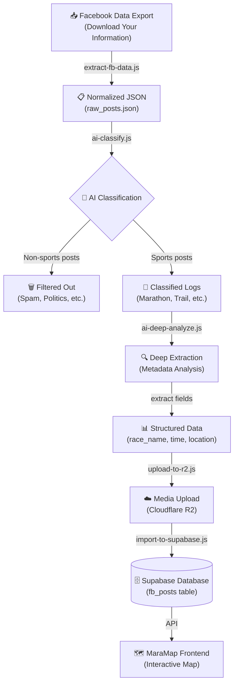

# MaraMap Data Pipeline

> **Choose your language / 選擇語言：**
> - [📖 客戶版 (Client Version) - 中文](#-client-version--中文) 
> - [🛠 開發者版 (Developer Version) - English](#-developer-version--english)

---

<a name="-client-version--中文"></a>
## 📖 客戶版 (Client Version) - 中文

### MaraMap 如何幫您整理馬拉松紀錄

#### 🎯 流程概覽
```
您的 Facebook 相片與文字
    ↓
📍 AI 自動辨識運動內容
    ↓
🎯 自動填寫成績與地點
    ↓
🗺️ 在地圖上看見您的足跡
```

---

### 📱 四個簡單步驟

#### **第 1 步：準備您的回憶**
我們從您的 Facebook 下載了過去幾年的所有分享記錄。裡面有您參賽的相片、完賽時間、心得分享……等等。

#### **第 2 步：AI 幫您篩選**
MaraMap 的 AI 聰明助手會逐一檢查每篇貼文，自動找出：
- ✅ 您跑過的馬拉松比賽
- ✅ 半馬、越野跑、健行等其他運動
- ❌ 過濾掉日常生活相關內容（保護隱私）

#### **第 3 步：自動整理成績**
這是最厲害的地方！AI 會理解您寫的每句話：

> 例子：您在 Facebook 上寫過「終於完成台北馬！4 小時整，人生第 200 場馬拉松 🏃💪」
>
> AI 會自動記錄：
> - 📅 **日期**：當天的比賽日期
> - 📍 **地點**：台北（並在地圖上標記）
> - ⏱️ **成績**：4 小時 0 分 0 秒
> - 🏆 **累計場數**：第 200 場

您不需要手動填表格，**過去幾年的所有成績 AI 都會幫您整理好**。

#### **第 4 步：查看您的足跡地圖**
所有資料現在都變成您在 MaraMap 上看到的內容：
- 🔴 **紅點標記**：地圖上顯示您跑過的每個城市
- 🖼️ **精美卡片**：點開任何標記，看到當天的相片、成績、心得
- 🌍 **全球統計**：自動計算您征服了多少個國家的賽道

---

### 🔄 新增賽事（日常更新）

當您參加新的馬拉松並在 Facebook 分享時：

1. **登入管理後台** → 點擊「新增賽事」
2. **貼上 Facebook 內容** → AI 會自動填寫：
   - 比賽名稱
   - 完賽時間
   - 地點與累計場數
3. **確認無誤** → 按「儲存」，地圖立即更新！

通常 AI 的判斷準確率很高，您只需檢查是否有明顯錯誤。

---

<a name="-developer-version--english"></a>
## 🛠 Developer Version - English

### System Architecture Overview

#### **Data Flow Diagram**


---

### 🔧 Processing Stages

#### **Stage 1: Data Ingestion**
**Script:** `scripts/extract-fb-data.js`

- **Input:** Facebook JSON export (Download Your Information format)
- **Process:**
  - Scan the `posts/` directory
  - Extract post content, timestamps, and media paths
  - Normalize FB's nested structure into flat JSON
- **Output:** `raw_posts.json` with consistent schema

**Schema:**
```json
{
  "posts": [
    {
      "id": "post_123",
      "content": "...",
      "timestamp": 1234567890,
      "media": ["/path/to/image.jpg"]
    }
  ]
}
```

---

#### **Stage 2: AI Classification**
**Script:** `scripts/ai-classify.js`

- **LLM Model:** Google Gemini 1.5 Flash / Pro
- **Purpose:** Filter non-sports content and categorize sports activities
- **Classification Categories:**
  - `marathon`: Marathon races
  - `trail`: Trail running / ultra
  - `travel`: Travel & tourism
  - `daily`: Daily life (filtered out)
  - `spam`: Politics, reposts, etc. (filtered out)

- **Output:** Classified JSON with category labels and confidence scores
  ```json
  {
    "post_id": "post_123",
    "category": "marathon",
    "confidence": 0.95,
    "reasoning": "Post mentions race completion time and marathon count"
  }
  ```

---

#### **Stage 3: Deep Data Extraction**
**Script:** `scripts/ai-deep-analyze.js`

- **Input:** Posts classified as `marathon`
- **Purpose:** Extract structured race metadata from natural language
- **Extracted Fields:**
  - `race_name`: Official race name (e.g., "2024 Taipei Marathon")
  - `date`: Race date (parsed from post or metadata)
  - `participants`: Array of runners (e.g., ["Davis", "Rose"])
  - `finish_time`: Completion time in HH:MM:SS format
  - `distance_km`: Official race distance
  - `fm_count`: Cumulative full marathon count
  - `hm_count`: Cumulative half marathon count
  - `location`: {
      - `city`: City name
      - `country`: Country code (ISO 3166-1 alpha-2)
      - `coordinates`: [lat, lng] (if available from media metadata)
    }

- **Example Output:**
  ```json
  {
    "race_name": "2024 Taipei Marathon",
    "date": "2024-03-10",
    "participants": ["Davis"],
    "finish_time": "04:00:00",
    "distance_km": 42.195,
    "fm_count": 200,
    "location": {
      "city": "Taipei",
      "country": "TW",
      "coordinates": [25.0330, 121.5654]
    }
  }
  ```

---

#### **Stage 4: Media & Persistence**

**4a. Media Upload**
**Script:** `scripts/upload-to-r2.js`

- Upload all post images to Cloudflare R2 bucket
- Generate public CDN URLs
- Maintain mapping of original file → R2 URL
- Output: JSON mapping file with URLs

**4b. Database Import**
**Script:** `scripts/import-to-supabase.js`

- Insert processed race records into `supabase.fb_posts` table
- Link media URLs from R2
- Handle duplicates and updates
- Maintain referential integrity

**Database Schema (`fb_posts`):**
```sql
CREATE TABLE fb_posts (
  id TEXT PRIMARY KEY,
  post_content TEXT,
  race_name TEXT,
  date DATE,
  participants TEXT[],
  finish_time INTERVAL,
  distance_km NUMERIC,
  fm_count INT,
  hm_count INT,
  location JSONB,  -- {city, country, coordinates}
  media_urls TEXT[],  -- R2 URLs
  created_at TIMESTAMP,
  updated_at TIMESTAMP
);
```

---

### 🔄 Continuous Updates (Admin Panel)

For new races after initial import:

1. **Manual Entry:** Admin clicks "Add New Race"
2. **AI Assistance:** Paste Facebook post content
3. **Auto-fill:** System applies same extraction logic:
   - Classifies content as sports
   - Extracts metadata
   - Generates R2 URLs if images provided
4. **Validation:** Admin reviews extracted data
5. **Save:** Upsert to `fb_posts`, frontend auto-refreshes

---

### 🏗️ Technology Stack

| Component | Technology |
|-----------|-----------|
| Data Extraction | Node.js (JavaScript) |
| LLM Classification | Google Gemini 1.5 API |
| Media Storage | Cloudflare R2 (S3-compatible) |
| Database | Supabase (PostgreSQL) |
| Frontend | Next.js 15 + TypeScript |
| Visualization | Map library (TBD) |

---

### 📋 Processing Scripts Location

All scripts located in `MaraMap-Backend/scripts/`:
- `extract-fb-data.js` - Ingestion
- `ai-classify.js` - Classification
- `ai-deep-analyze.js` - Deep extraction
- `upload-to-r2.js` - Media upload
- `import-to-supabase.js` - DB import

---

### ⚠️ Error Handling & Reliability

- **Partial Failures:** Each stage outputs intermediate JSON files for manual review
- **Duplicate Detection:** Compare post IDs before insert/update
- **Coordinate Recovery:** Fallback to geocoding if media metadata unavailable
- **Logging:** Comprehensive logs for each stage in `scripts/logs/`

---

### 🚀 Future Enhancements

- [ ] Real-time Facebook Graph API integration (replace manual export)
- [ ] GPS track import from Strava/Garmin
- [ ] Photo clustering by race event
- [ ] Performance analytics dashboard
- [ ] Webhook notifications for new races
